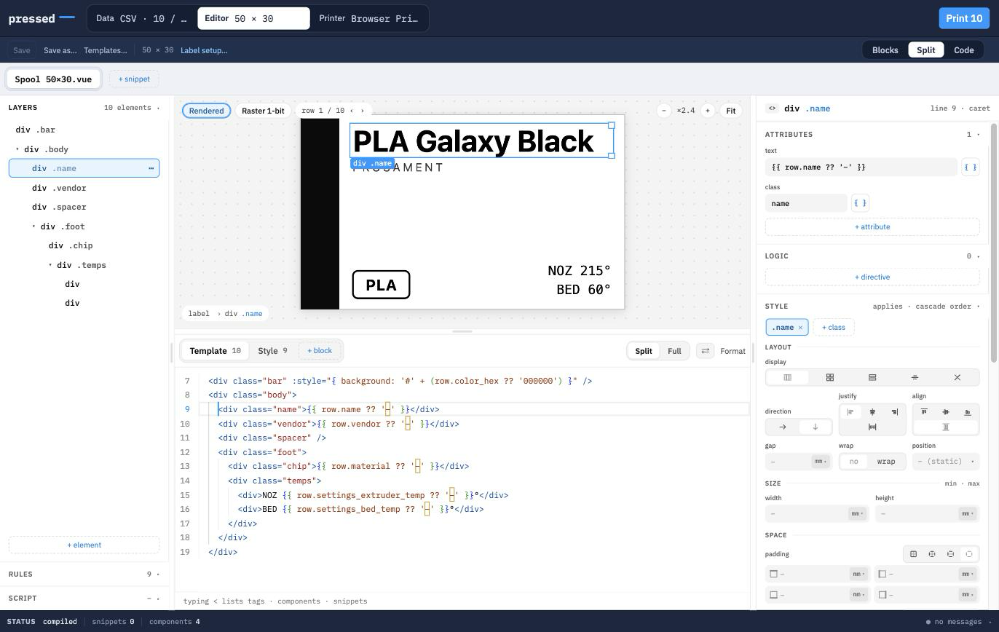

<p align="center">
  
</p>

<h1 align="center">Pressed</h1>

<p align="center">
  <b>Print your own labels.</b><br>
  A browser app that turns a spreadsheet and a template into labels, on the printer you already have.
</p>

<p align="center">
  <a href="https://dennistimmermann.github.io/pressed/">Open Pressed</a> ·
  <a href="https://github.com/dennistimmermann/pressed/issues">Issues</a>
</p>

<p align="center">
  
</p>

Label software comes with the printer, and it shows: a fixed set of layouts, a fixed set of
fields, and no way to point it at the data you actually keep. Pressed takes the other route.
You bring the data — a CSV, a Spoolman instance — and you design the label yourself, in
millimetres, on a canvas that shows you the document that will print. Then it prints, either
through the browser or straight to a thermal printer over USB.

It runs entirely in your browser. No account, no upload, no server.

## Features

- **Your data, wired once** — load a CSV or connect Spoolman, wire its columns to the fields your template asks for, and every row you tick becomes a label
- **Two ways into the same file** — build the label by clicking elements, layers and style controls, or edit its Vue source directly; the panes and the code stay in sync, on one file
- **Millimetre-true preview** — what you see *is* the document that prints: black on white, sized in real millimetres, with a 1-bit raster view of exactly what a thermal head will burn
- **Sheets and rolls** — lay labels out N-up on A4 or Letter with your own margins and gaps, or set the roll advance for continuous stock; rotate, and take the copy count from a data column
- **Prints two ways** — the browser print dialog for sheet stock, or TSPL over WebUSB straight to a thermal label printer, with no driver and no vendor app in between
- **Five templates to start from** — spool labels with a QR code or a barcode, a pantry jar label, a screw drawer label; duplicate one and make it yours
- **Template code is sandboxed** — it compiles and renders inside a null-origin frame, with no access to the app, your data or the printer, and may import nothing but `vue`, `pressed` and `qrcode`

## Open it

[**dennistimmermann.github.io/pressed**](https://dennistimmermann.github.io/pressed/) — nothing
to install. Templates you make are saved in your browser.

Printing over USB needs Chrome or Edge, which are the browsers that implement WebUSB. The
browser print dialog works anywhere.

Or run it yourself:

```sh
git clone https://github.com/dennistimmermann/pressed.git
cd pressed
npm install
npm run dev          # http://localhost:5173
```

## Using it

Three views, across the top: **Data**, **Editor**, **Printer**. The one filled button in the
app is **Print**, and it tells you how many labels it is about to make.

| View | What you do there |
|---|---|
| **Data** | Pick a source — a **CSV file**, a **Spoolman** server, or **None** if you just want *n* copies of a fixed label. **Table** lists the rows and lets you tick the ones to print; **Wiring** connects source fields to the `row.*` fields your template asks for. **Suggest** wires up the exact-name matches; the rest you point at by hand. |
| **Editor** | The template itself. **Blocks** is the canvas alone, **Code** the source alone, **Split** both. Left: the element tree, the style rules, the script. Right: what's under the caret — attributes, bindings, and a full style pane. Bottom: compile, render and purity messages, each one clickable straight to the line. |
| **Printer** | Choose the label size, the **output** — a sheet grid or a roll — and how it prints: the browser dialog, or **Direct** over WebUSB. Pressed shows the plan before you commit: "24 per sheet → 2 sheets", or "3-up → 4 sets ≈ 0.13 m of roll". |

### The templates that ship with it

| Template | Size | For |
|---|---|---|
| **Spool 50×30** | 50 × 30 mm | Filament spool: a colour bar in the filament's own colour, name, vendor, material and temperatures |
| **Spool 40×50 QR** | 40 × 50 mm | Portrait spool label with a large QR code of the spool id |
| **Spool 40×15 barcode** | 40 × 15 mm | Narrow strip with a full-width Code 128 of the lot number |
| **Grocery 40×30** | 40 × 30 mm | Pantry jar: name, weight, packed and use-by dates |
| **Screw 20×10** | 20 × 10 mm | Fastener drawer: thread × length, head and drive |

They are read-only; editing one saves your own copy. Templates import and export as plain
`.vue` files.

## Writing a template

A template is a single Vue SFC with a `<meta>` block that gives it a name and a size in real
millimetres:

```vue
<meta>{ "name": "Spool label", "size": { "width": 60, "height": 40 } }</meta>

<snippet name="badge" props="text"><span class="badge">{{ text }}</span></snippet>

<template>
  <div class="title">{{ row.name }}</div>
  <badge :text="row.material" />
  <QrCode :value="`spool:${row.id}`" size="16mm" />
</template>

<style>.title { font: 700 13pt system-ui }</style>
```

`row` is the current row, straight from your data source — available in the markup, and via
`import { useRow } from 'pressed'` in `<script setup>`. `<snippet>` blocks are components you
define in the same file. Four come built in: **`QrCode`**, **`Barcode`** (Code 128),
**`Img`** and **`Fit`**. Images you bundle with the template are referenced as `asset:name`
and become data URLs at render time.

Templates render once, to static HTML. Lifecycle hooks, timers and browser APIs raise a purity
warning — the label still renders, but a template that needs a running clock is a template
that will not print the same thing twice.

## Printing to a thermal printer

**Direct** output speaks TSPL over WebUSB. The label is rasterized and dithered to 1 bit at
the printer's dpi, then sent as a `BITMAP` — so what the raster preview shows is what the head
burns. You set dpi, maximum dots across, density and speed; the defaults are measured from a
203 dpi / 576 dot ChiTenk K30F.

Two things that will otherwise cost you an evening:

- **Switch the printer on before you plug it in.** Powered up after enumeration, it comes up
  half-dead with VID/PID `0`, and claiming the interface fails.
- **Web fonts and external images do not survive the raster path.** Bundle a font or image as
  a template asset, or use system fonts. Pressed says so in the Status pane rather than
  printing a blank.

## Development

npm workspaces, no build step anywhere: Vite, vitest and vue-tsc read the TypeScript sources
directly.

```sh
npm run dev          # http://localhost:5173
npm test             # vitest, whole monorepo
npm run typecheck    # vue-tsc over packages/core and apps/web
npm run build        # apps/web → apps/web/dist
npm run lint         # oxlint
```

| Path | What |
|---|---|
| `packages/core` | DOM-free, so it keeps running in Node: template loader, compiler and renderer, the component library, 1-bit dither, TSPL encoder, imposition, data sources. `runtime/main.ts` is the sandboxed frame script. |
| `apps/web` | The app: shell, views, stores, printers, tokens, plus `src/editor` (a label-agnostic Vue SFC editor), `src/ui` and `src/render`. |

Preview, print and raster all go through the same standalone HTML document, which is why the
preview can be trusted. That document is rendered inside `runtime.html`, embedded as
`<iframe sandbox="allow-scripts">` so template code runs on a null origin. Because that origin
is opaque, every module the frame loads is a cross-origin fetch: whatever serves Pressed must
send `Access-Control-Allow-Origin` for `/runtime.html` and its assets. The Vite dev and preview
servers do; so does GitHub Pages.

## Support

Bugs and requests go to [Issues](https://github.com/dennistimmermann/pressed/issues).

---

[MIT](LICENSE) © 2026 Dennis Timmermann
